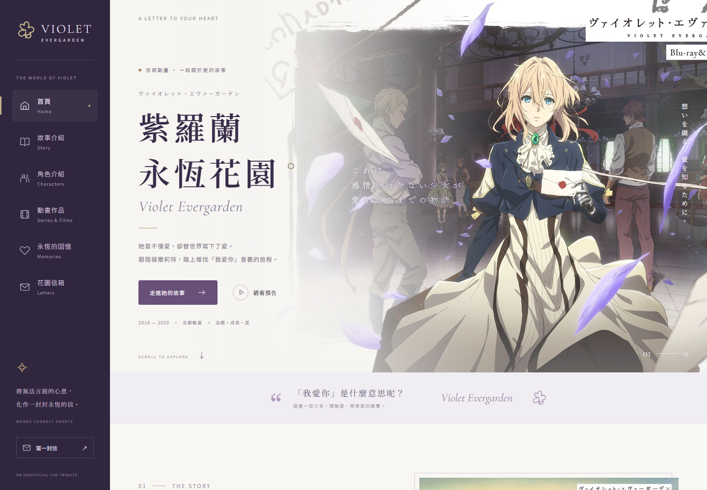

# VioletWeb 紫羅蘭永恆花園

線上網站：https://www.kurumicute.com/ 

VioletWeb 是一個以《紫羅蘭永恆花園》為主題的互動介紹網站，使用 React、TypeScript、Go 與 MySQL 開發，包含故事介紹、角色探索、動畫作品與公開信件收藏。

介面以深紫色、信紙與花園為主題，支援桌面與行動裝置，透過捲動淡入、角色切換與信紙閱讀視窗，呈現作品中關於愛與思念的故事。



## 主要功能

### 動畫介紹

- 故事背景與作品世界觀介紹
- 角色切換與人物介紹
- TV 動畫、外傳與劇場版分類篩選
- 作品詳情視窗與官方網站連結
- YouTube 官方預告播放與行動裝置內嵌播放

### 花園信箱

- 撰寫信件標題、收信人、署名與正文
- 將信件儲存至 MySQL，支援中文、emoji 與換行
- 自行選擇公開或私人保存，預設不公開
- 以信紙卡片展示公開信件，點擊閱讀全文
- 公開信件分頁載入，每次九封
- 瀏覽器草稿保存與儲存失敗提示
- 提交識別碼避免重試造成重複信件

私人信件僅儲存於資料庫，不會出現在公開 API 或信件牆。目前沒有會員帳號、私人信箱頁、刪文後台或審核流程；信件不會以電子郵件寄出。

### 介面與互動

- 桌面側邊導覽與手機版導覽列
- 各區塊首次進入畫面時淡入
- 配合使用者的「減少動態效果」設定
- 圖片依原始比例呈現，保留人物頭部與畫面
- 支援鍵盤操作、Escape 關閉視窗與焦點管理
- 預告按鈕預先建立 YouTube 連線，播放時停用背景模糊

## 技術架構

| 類別       | 使用技術                                 |
| ---------- | ---------------------------------------- |
| 前端       | React、TypeScript、Vite             |
| 樣式       | CSS Grid、Flexbox、CSS Transitions       |
| 後端       | Go、標準函式庫 net/http                  |
| 資料庫     | MySQL、database/sql、go-sql-driver/mysql |
| 程式碼品質 | ESLint、Prettier、gofmt                  |
| 測試       | Go testing、Playwright                   |

## 系統需求

- Node.js 20.19 以上的 20.x，或 22.12 以上版本
- npm
- Go 1.24 以上
- MySQL 8.0 以上
- Git

## 安裝與啟動

### 1. 取得專案

```sh
git clone https://github.com/kurumicute/VioletWeb.git
cd VioletWeb
npm ci
```

所有 `npm` 指令皆在專案根目錄執行，也就是含有 `package.json` 的目錄。

### 2. 設定資料庫連線

複製本機設定範本。

PowerShell：

```powershell
Copy-Item server/config.example.json server/config.local.json
```

macOS / Linux：

```sh
cp server/config.example.json server/config.local.json
```

編輯 `server/config.local.json`，填入自己的資料庫帳號與密碼：

```json
{
  "databaseHost": "127.0.0.1:3306",
  "databaseUser": "root",
  "databasePassword": "replace-with-your-database-password",
  "databaseName": "violet_garden",
  "port": "8081",
  "staticDir": "../dist"
}
```

`config.local.json` 已排除版本控制。Repository 只提供範本，不包含實際連線密碼。

也可使用環境變數，環境變數的值會優先於 JSON 設定：

| 變數          | 預設值           | 說明                             |
| ------------- | ---------------- | -------------------------------- |
| `DB_HOST`     | `127.0.0.1:3306` | MySQL 主機與連接埠               |
| `DB_USER`     | `root`           | MySQL 帳號                       |
| `DB_PASSWORD` | 無，必填         | MySQL 密碼                       |
| `DB_NAME`     | `violet_garden`  | 資料庫名稱                       |
| `PORT`        | `8081`           | Go HTTP 連接埠                   |
| `STATIC_DIR`  | `../dist`        | 前端建置目錄，相對於 Go 工作目錄 |

設定檔由 Go 後端讀取，不會送至瀏覽器。專案不會自動讀取 `.env`；使用環境變數時，請由終端或部署服務注入。

### 3. 建立 MySQL 資料庫

確認 MySQL 服務已啟動。後端啟動時會自動建立 `violet_garden` 與 `letters` 資料表；設定的帳號需要建立資料庫、建立資料表與讀写權限。

若希望像一般 SQL 專案一樣先手動匯入，可使用 [database/schema.sql](database/schema.sql)。它只包含結構，不包含使用者信件或帳號密碼。

在專案根目錄啟動 MySQL 用戶端：

```sh
mysql --default-character-set=utf8mb4 -u root -p
```

輸入密碼後，在 MySQL 提示字元執行：

```sql
SOURCE database/schema.sql;
USE violet_garden;
SHOW TABLES;
```

應顯示 `letters`。SQL 使用 `IF NOT EXISTS`，重複執行不會刪除既有資料。此手動匯入檔使用預設資料庫名稱；如有修改 `DB_NAME`，可直接讓後端初始化指定資料庫。

### 4. 啟動後端

```sh
npm run server
```

後端預設位址：`http://localhost:8081`

健康檢查：`http://localhost:8081/api/health`

此指令會在 `server/` 啟動 Go，並自動下載 Go 模組依賴。Windows 也會偵測預設安裝位置 `C:/Program Files/Go/bin/go.exe`。

### 5. 啟動前端

開啟另一個終端，進入相同專案根目錄後執行：

```sh
npm run dev
```

前端預設位址：`http://localhost:5174`

Vite 將 `/api` 代理至 `http://localhost:8081`。如果修改後端連接埠，請同步調整 [vite.config.ts](vite.config.ts)。若前端連接埠已被占用，以終端顯示的實際網址為準。

## 正式建置

```sh
npm run build
npm run server
```

建置產物位於 `dist/`。開啟 `http://localhost:8081`，由 Go 同時提供靜態網頁與 API，不需要啟動 Vite。

部署完整功能需要可執行 Go 的主機及 MySQL。單獨將前端上傳 GitHub Pages 不會提供信件儲存 API。

## 專案結構

```text
VioletWeb/
├── database/
│   └── schema.sql          可獨立匯入的 MySQL 結構
├── docs/images/            README 預覽圖片
├── public/images/          動畫與角色圖片
├── scripts/
│   ├── server.mjs          Go 啟動與測試入口
│   └── export-schema.mjs   產生公開 SQL 結構檔
├── server/
│   ├── main.go             路由與 HTTP 服務
│   ├── config.go           本機設定與環境變數
│   ├── database.go         MySQL 連線與初始化
│   ├── letters.go          驗證、SQL 儲存與分頁查詢
│   ├── handlers.go         API 請求與回應
│   ├── schema.sql          資料表結構的原始來源
│   └── config.example.json 設定範本
├── src/
│   ├── components/         頁面區塊、表單、信件牆與視窗
│   ├── data/               動畫與角色資料
│   ├── hooks/              捲動導覽、淡入效果、資料載入
│   ├── services/           API、草稿及預告連線
│   ├── styles/             分區樣式與響應式版面
│   └── App.tsx             頁面組合與視窗狀態
├── tests/                  Playwright 瀏覽器測試
└── package.json
```

修改資料表時，先更新 `server/schema.sql`，再執行 `npm run db:schema` 同步產生 `database/schema.sql`。此指令只讀取 SQL 結構檔，不連線或匯出 MySQL 資料。

## API

| 方法 | 路徑                      | 功能                       |
| ---- | ------------------------- | -------------------------- |
| GET  | `/api/health`             | 檢查服務及 MySQL 連線      |
| GET  | `/api/quotes`             | 取得主題心語               |
| GET  | `/api/letters`            | 取得最新公開信件           |
| GET  | `/api/letters?before=123` | 取得指定 ID 之前的公開信件 |
| POST | `/api/letters`            | 儲存私人或公開信件         |

信件提交使用 `application/json`：

| 欄位           | 說明                     |
| -------------- | ------------------------ |
| `submissionId` | UUID，用於避免重複提交   |
| `title`        | 信件標題，1–120 字       |
| `sender`       | 署名，1–80 字            |
| `recipient`    | 收信人，1–80 字          |
| `body`         | 內文，1–10,000 字        |
| `isPublic`     | 是否公開，預設為 `false` |

儲存成功回傳 `id` 與 `isPublic`；列表回傳 `letters` 與 `nextCursor`。提交識別碼不是私人信件的讀取憑證。


## 素材與作品資訊

這是非官方粉絲介紹網站，與動畫官方沒有隸屬關係。

- [TV 動畫官方網站](https://tv.violet-evergarden.jp/)
- [劇場版官方網站](https://violet-evergarden.jp/)
- [官方預告](https://www.youtube.com/watch?v=NSIzsFOfd8M)

動畫名稱、角色及相關圖像權利歸原權利人所有。Google Fonts 提供 Noto Sans TC、Noto Serif TC 與 Cormorant Garamond；無網路時使用系統字型。圖片放置於 `public/images/`，預告播放需要連線 YouTube。網站心語為原創主題文字，並非動畫逐字台詞。
